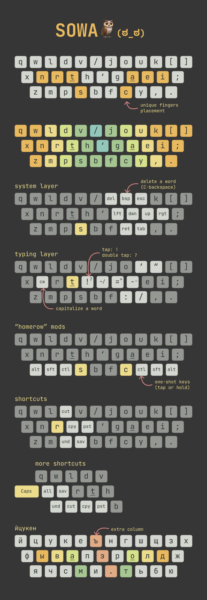

# SOWA

_Custom keyboard layout. Powered by [kanata](https://github.com/jtroo/kanata) keyboard remapper._



## Quick start

See [Linux setup](https://github.com/jtroo/kanata/blob/main/docs/setup-linux.md) docs.

There are 2 config files: `sowa.kbd` for TKL-87 keyboard, `sowa-60.kbd` for 60% keyboard.

```bash
kanata --cfg sowa.kbd
```

## Features

- 2 layouts: default QWERTY, custom SOWA layout;
- complimentary ЙЦУКЕН layout;
- custom layers: shortcuts, punctuation, etc;
- small QoL features like capitalize a word or sticky keys.

## Usage tips

Use `~` (or `ralt`) to switch layers:

- `~ + q` switch to QWERTY, `~ + 1` switch to SOWA
- `~ + 2` live reload kanata config

Use `tab` for 60% keyboard:

 - `tab + r` live reload kanata config
 - `tab + q` switch to QWERTY layout
 - `tab + w` switch to SOWA layout

## Adding/restoring ЙЦУКЕН/cyrillic layout

Any custom layout reshuffles keys for other languages. To be able to use (almost!) default Russian ЙЦУКЕН layout you have to do the following:

1. Add new symbols (`r1` or `r2`) to system:

- `r1` refers to ЙЦУКЕН layout;
- `r2` refers to custom cyrillic layout.

```
sudo ln -sr r1 /usr/share/X11/xkb/symbols/
```

2. Add new rules to system:

```
sudo micro /usr/share/X11/xkb/rules/evdev.xml
```

Paste these lines (with proper name `r1` or `r2`) somewhere near Russian layouts (tip! search for `<description>Russian</description>` to locate those rules):

```
<!-- SOWA -->
<layout>
  <configItem>
    <name>r1</name>
    <shortDescription>Russian (SOWA)</shortDescription>
    <description>Russian (SOWA)</description>
    <languageList>
      <iso639Id>rus</iso639Id>
    </languageList>
  </configItem>
</layout>
```

3. Add new `Russian (SOWA)` layout in settings (or `setxkbmap`) as usual (`setxkbmap -layout us,r1`).

## Links

- [Linux: How to make your own keyboard layout](https://lipanski.com/posts/custom-keyboard-layout) by Florin Lipan;

## TODO

- [x] pick proper name for custom layout;
- [ ] add fancy images with layout and heatmaps;
- [ ] switch K and J keys;
- [ ] add philosophy, pros/cons section;
- [x] how to add (restore) RU layout;
- [ ] describe differences to RU layout coz it's wider too;
- [ ] add `r2` layout description;
