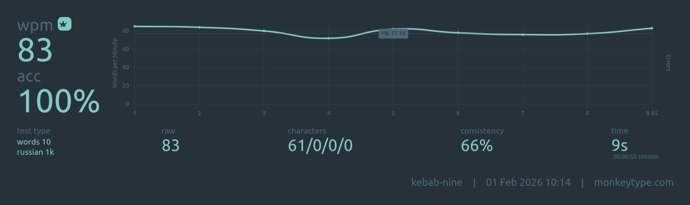

## Update!

After buying a split keyboard I've decided to try a layout with thumb letter. For English I _strongly_ recommend **Hands Down Promethium** (bottom heavy variant):
```
  v w g m [      ] \ . , ' z
  s n t h k      q a e i c ;
  f p d l x      j u o y b /
        r
```
Note: place rare keys (`q`, `j`, `z`) wherever you'd like. I also use combo `u + y` for `qu`, it's quite helpful.

For Russian I use another custom layout with somewhat decent stats (I guess):
```
  ё ы й г ю      ф ц к л ш
  и о а м х      щ д н р т
  у я ь с ж      б в п ч з
        е
```
Note: place rare keys (`э`, `ъ`) wherever you'd like. I also use a combo `в + ч` for `ться`.

After few months of practice I can say this layout feels good. I have only one minor complain about `г` key (I press it with middle finger btw). It will be nice to have that key on the right side. I've tried a combo `в + п` but result was meh.

<details>
  <summary>oxey's stats</summary>

```
Finger usage:

finger 0: 	9.87% 	finger 9: 	8.42%
finger 1: 	14.10% 	finger 8: 	10.29%
finger 2: 	10.44% 	finger 7: 	12.56%
finger 3: 	12.30% 	finger 6: 	10.10%

Left hand: 46.70%       Right hand: 41.37%
Left center: 2.352%     Right center: 2.241%
Home keys usage: 49.38%

Sfb% per finger:
finger 0: 	0.010% 	finger 9: 	0.023%
finger 1: 	0.095% 	finger 8: 	0.049%
finger 2: 	0.117% 	finger 7: 	0.170%
finger 3: 	0.212% 	finger 6: 	0.216%

Sfb:  0.892%
Dsfb: 5.934%
Lsb:  0.764%

Inrolls: 21.352%
Outrolls: 15.144%
Total Rolls: 36.496%
Onehands: 1.550%

Alternates: 38.447%
Alternates (sfs): 8.887%
Total Alternates: 47.334%

Redirects: 4.923%
BadRedirects: 0.149%
Total Redirects: 5.072%

Other: 4.669%
Invalid: 4.880%
```
</details>

Note: btw you can get a little bit better stats without thumb key (less sfb, more lsb), didn't practice it:
```
. у ы Е г ю      Ц Ч к л ш щ
э и о а м х      ф д н р т ъ
  ё я ь с ж      б в п Й з
```


My current PBs on short MonkeyType tests (10 words, 1k set) are: for English is 92wpm, for Russian is 91wpm. So in terms of speed this RU layout is the same as Promethium and "safe" to use.

### But wait! There is more!

Searching a better place for a `г` letter results into new layout:

```
  э ы й ж ф      щ ч р п б
  и о а д ш      х в н т к
  у я ь с ю      ц м л г з
          е
```
Note: I use a combo `м + г` for `ться`.

<details>
  <summary>oxey's stats</summary>

```
Finger usage:

finger 0: 	10.14% 	finger 9: 	6.40%
finger 1: 	14.10% 	finger 8: 	10.72%
finger 2: 	10.44% 	finger 7: 	15.46%
finger 3: 	10.64% 	finger 6: 	10.45%

Left hand: 45.33%   	Right hand: 43.02%
Left center: 1.502% 	Right center: 1.783%
Home keys usage: 48.98%

Sfb% per finger:
finger 0: 	0.014% 	finger 9: 	0.057%
finger 1: 	0.095% 	finger 8: 	0.034%
finger 2: 	0.117% 	finger 7: 	0.232%
finger 3: 	0.425% 	finger 6: 	0.081%

Sfb:  1.054%
Dsfb: 5.989%
Lsb:  0.708%

Inrolls: 23.235%
Outrolls: 12.275%
Total Rolls: 35.510%
Onehands: 1.466%

Alternates: 39.383%
Alternates (sfs): 9.941%
Total Alternates: 49.325%

Redirects: 3.549%
BadRedirects: 0.155%
Total Redirects: 3.704%

Other: 5.115%
Invalid: 4.880%

```
</details>

The main differences are lower redirects and better `г` placement. This layout has more sfbs but it's not a problem because they come from strong left index finger. You can get better stats after switching `д` and `г` keys but then it will be too much load for a right ring finger.



In terms of comfort this new version feels the same (or maybe slightly better) as the previous one.

It seems like it's better to switch `д` and `з`:

```
  э ы й ж ф      щ ч р п б
  и о а З ш      х в н т к
  у я ь с ю      ц м л г Д
          е
```
<details>
  <summary>oxey's stats</summary>

```
Finger usage:

finger 0: 	10.14% 	finger 9: 	7.77%
finger 1: 	14.10% 	finger 8: 	10.72%
finger 2: 	10.44% 	finger 7: 	15.46%
finger 3: 	9.26% 	finger 6: 	10.45%

Left hand: 43.95% 	  Right hand: 44.40%
Left center: 1.502% 	Right center: 1.783%
Home keys usage: 47.60%

Sfb% per finger:
finger 0: 	0.014% 	finger 9: 	0.050%
finger 1: 	0.095% 	finger 8: 	0.034%
finger 2: 	0.117% 	finger 7: 	0.232%
finger 3: 	0.104% 	finger 6: 	0.081%

Sfb:  0.726%
Dsfb: 5.743%
Lsb:  0.708%

Inrolls: 22.811%
Outrolls: 11.889%
Total Rolls: 34.700%
Onehands: 1.043%

Alternates: 42.039%
Alternates (sfs): 10.064%
Total Alternates: 52.103%

Redirects: 2.707%
BadRedirects: 0.181%
Total Redirects: 2.888%

Other: 4.386%
Invalid: 4.880%

```
</details>

Pros:
- less sbfs 1.0% -> 0.7%;
- less redirects 3.5% -> 2.7%.

Cons:
- more load on right pinky 6.4% -> 7.8%;
- less load on left index 10.6% -> 9.3%.

---


Obsolete SOWA layout. See [wiki page](https://github.com/greqov/sowa/wiki) for details.

