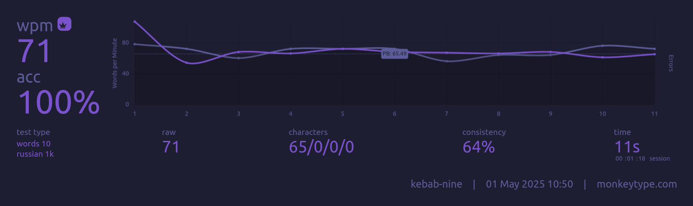
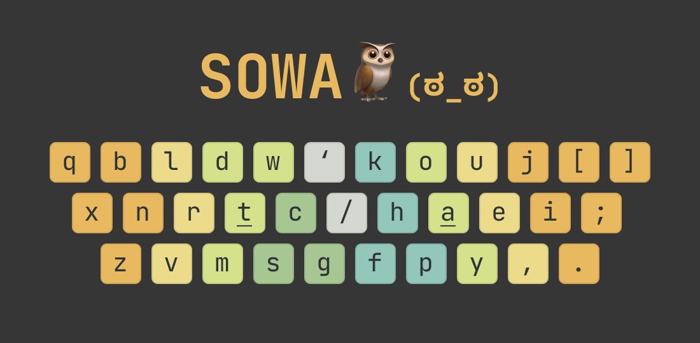
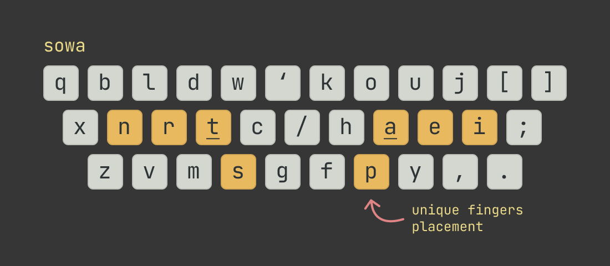
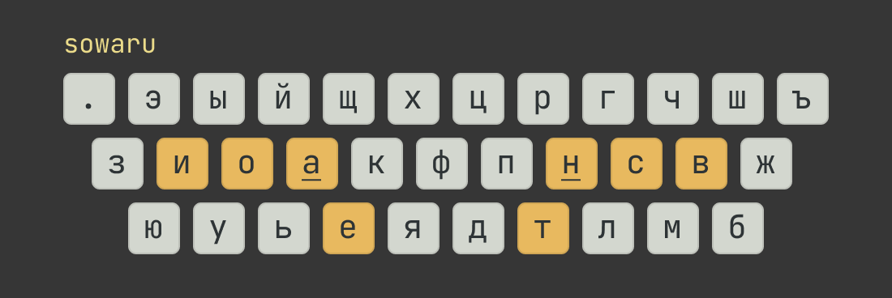

## Update!!!

After buying a split keyboard I've decided to try a layout with thumb letter. For English I _strongly_ recommend **Hands Down Promethium** (bottom heavy variant):
```
  v w g m [      ] \ . , ' z
q s n t h k      / a e i c ;
  f p d l x      j u o y b
        r
```
Note: place rare keys (`q`, `j`, `z`) wherever you'd like. I also use combo `u + y` for `qu`, it's quite helpful.

For Russian I use another custom layout with somewhat decent stats (I guess):
```
. ё ы й г ю        ц к л ш щ
э и о а м х      ф д н р т ъ
  у я ь с ж      б в п ч з
        е
```
Note: place rare keys (`э`, `щ`, `ъ`) wherever you'd like. I also use a combo `в + ч` for `ться`.

After few months of practice I can say this layout feels good. I have only one minor complain about `г` key (I press it with middle finger btw). It will be nice to have that key on the right side. I've tried a combo `в + п` but result was meh.

oxey's stats:
```
Finger usage:
finger 0: 	9.87% 	finger 9: 	8.42%
finger 1: 	14.10% 	finger 8: 	10.29%
finger 2: 	10.44% 	finger 7: 	12.56%
finger 3: 	12.30% 	finger 6: 	9.75%

Left hand: 46.70%     Right hand: 41.02%
Left center: 2.352%   Right center: 1.891%
Home keys usage: 49.38%

Sfb% per finger:
finger 0: 	0.010% 	finger 9: 	0.023%
finger 1: 	0.095% 	finger 8: 	0.049%
finger 2: 	0.117% 	finger 7: 	0.170%
finger 3: 	0.212% 	finger 6: 	0.135%

Sfb:  0.811%
Dsfb: 5.841%
Lsb:  0.744%

Inrolls: 23.033%
Outrolls: 16.194%
Total Rolls: 39.227%
Onehands: 1.503%

Alternates: 35.052%
Alternates (sfs): 8.106%
Total Alternates: 43.158%

Redirects: 5.279%
BadRedirects: 0.149%
Total Redirects: 5.428%

Other: 4.444%
Invalid: 6.240%

```

Note: btw you can get a little bit better stats without thumb key (less sfb, more lsb), didn't practice it:
```
. у ы Е г ю      Ц Ч к л ш щ
э и о а м х      ф д н р т ъ
  ё я ь с ж      б в п Й з
```



My current PBs on short MonkeyType tests (10 words, 1k set) are: for English is 92wpm, for Russian is 85wpm. So in terms of speed this RU layout is the same as Promethium and "save" to use.

---



# SOWA

_Custom keyboard layout. Powered by [kanata](https://github.com/jtroo/kanata) keyboard remapper._

This project contains:

- custom keyboard layout SOWA for English;
- custom keyboard layout SOWARU for Russian;
- kanata configs for regular row staggered and split column staggered keyboards;
- (still WIP) set of additional layers for using keyboard more efficiently.

## Why?

All modern alt layouts assume placing your fingers on "home" row, i.e. on `ASDF` and `KJL;` keys. I personally find this position uncomfortable. For me it's much more convenient to place index fingers on the bottom row, i.e. on `SDFV` and `NJKL` keys. And because of that reason all those layouts loose a lot of their eFfiCieNcY. That's why I decided to create a new layout for my "special needs". It's not super efficient in many metrics but who cares. After 3 attempts of redesigning and 1.5 years of practice I ended up with (mostly) adapting [graphite layout](https://github.com/rdavison/graphite-layout). Result SOWA layout has some flaws (see below) but I'm pretty happy with it. It places hands slightly wider. The right hand shifted 1 column to the right (so maybe swap `j` and `k` keys on your keyboard).

The same story goes for Cyrillic layout. Because why not? +1% efficiency? I will take that!
ЙЦУКЕН layout for Russian is not as bad as QWERTY for English but anyways. There are few alt layouts for Russian and kharlamak has the best metrics. I've tried to adapt it.

## Layouts



```
SOWA

qbldw ' kouj[]
xnrtc / haei;
zvmsg   fpy,.
```



```
SOWARU

.эыйщ х цргчшъ
зиоак ф пнсвж
юуьея   дтлмб
```

## Quick start

The easiest way to try/use alternative keyboard layout is using some remapping software. I picked kanata.

For Linux setup see [kanata Linux docs](https://github.com/jtroo/kanata/blob/main/docs/setup-linux.md).

```bash
kanata --cfg sowa-60.kbd
```

For Windows setup see section below.

Note: `sowa-60.kbd` config file is for 60% keyboards, `sowa-corne.kbd` is for split keyboards.

These configs work with default OS layouts QWERTY/ЙЦУКЕН. For more info about "magic" behind it see a wiki page in this repo.

## Usage tips

Use `ralt` (for 60% keyboards):

- `ralt + r` live reload kanata config
- `ralt + q` switch to QWERTY layout
- `ralt + w` switch to SOWA layout

## Windows setup

_/windows/kanata_ folder contains kanata files; just copy this folder (to `C:\bin\kanata\` for example), copy the latest `sowa-60.kbd` config file inside, launch with `kanata-launcher.bat`.

_Note:_ All those files here in for quick setup only. You can do this manually, no need to download suspicious `*.exe` files from the Internet. Check for the latest version of kanata.exe on github.

## Some "flaws" and annoyances

SOWA layout is not ideal and it has worse metrics because some fingers have access to few keys while others fingers "overloaded".

- it's quite hard to press `k` key (kick, king, like, backwards);
- I'm not fan of `br`, `rb`, `mb`, `bm`, `wn` bigrams (brown, down, downtown, umbrella);

## Other files

- _/jsons_ folder contains json files for [Keyboard Layout Analyzer KLAnext v0.06](https://klanext.keyboard-design.com/).

## TODO

- [ ] add fancy images with layout and heatmaps;
- [ ] make README more beginner friendly;
- [ ] create sane layer for punctuation, numbers, etc.
