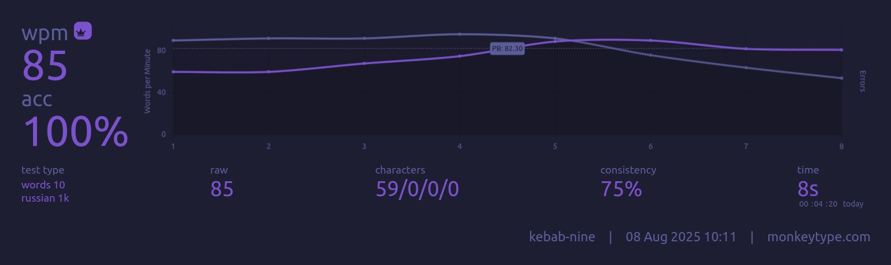

## Update!

After buying a split keyboard I've decided to try a layout with thumb letter. For English I _strongly_ recommend **Hands Down Promethium** (bottom heavy variant):
```
  v w g m [      ] \ . , ' z
  s n t h k      q a e i c ;
  f p d l x      j u o y b /
        r
```
Note: place rare keys (`q`, `j`, `z`) wherever you'd like. I also use combo `u + y` for `qu`, it's quite helpful.

For Russian I use another custom layout with somewhat decent stats (I guess):
```
  ё ы й г ю      ф ц к л ш
  и о а м х      щ д н р т
  у я ь с ж      б в п ч з
        е
```
Note: place rare keys (`э`, `ъ`) wherever you'd like. I also use a combo `в + ч` for `ться`.

After few months of practice I can say this layout feels good. I have only one minor complain about `г` key (I press it with middle finger btw). It will be nice to have that key on the right side. I've tried a combo `в + п` but result was meh.

oxey's stats:
```
Finger usage:

finger 0: 	9.87% 	finger 9: 	8.42%
finger 1: 	14.10% 	finger 8: 	10.29%
finger 2: 	10.44% 	finger 7: 	12.56%
finger 3: 	12.30% 	finger 6: 	10.10%

Left hand: 46.70%       Right hand: 41.37%
Left center: 2.352%     Right center: 2.241%
Home keys usage: 49.38%

Sfb% per finger:
finger 0: 	0.010% 	finger 9: 	0.023%
finger 1: 	0.095% 	finger 8: 	0.049%
finger 2: 	0.117% 	finger 7: 	0.170%
finger 3: 	0.212% 	finger 6: 	0.216%

Sfb:  0.892%
Dsfb: 5.934%
Lsb:  0.764%

Inrolls: 21.352%
Outrolls: 15.144%
Total Rolls: 36.496%
Onehands: 1.550%

Alternates: 38.447%
Alternates (sfs): 8.887%
Total Alternates: 47.334%

Redirects: 4.923%
BadRedirects: 0.149%
Total Redirects: 5.072%

Other: 4.669%
Invalid: 4.880%
```

Note: btw you can get a little bit better stats without thumb key (less sfb, more lsb), didn't practice it:
```
. у ы Е г ю      Ц Ч к л ш щ
э и о а м х      ф д н р т ъ
  ё я ь с ж      б в п Й з
```



My current PBs on short MonkeyType tests (10 words, 1k set) are: for English is 92wpm, for Russian is 91wpm. So in terms of speed this RU layout is the same as Promethium and "safe" to use.

There is another good Russian layout [vestnik](https://github.com/nxtk/vestnik-layout).
I learn mirrored version:
```
  э я а п ф      х г р д ц
  и е о в ь      б к н т с
  ю у ы й ж      ч м л з ш
```
Pros for vestnik:
* no need for thumb key
* good letters placement that make sense

So give it a shot!

---


Obsolete SOWA layout. See [wiki page](https://github.com/greqov/sowa/wiki) for details.

